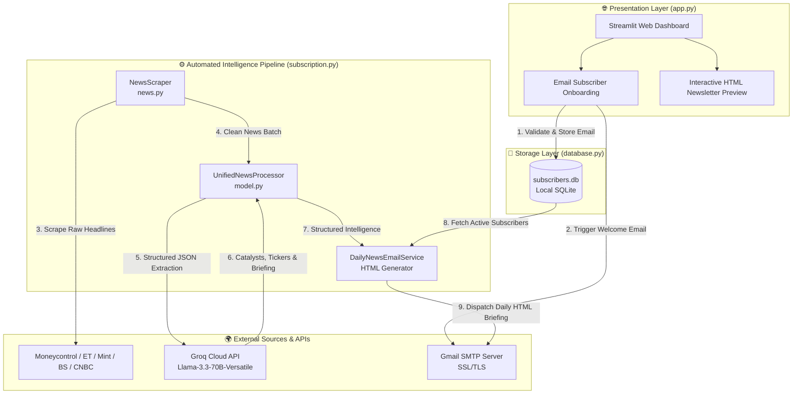

# 📈 FinPulse AI

<div align="center">

**An Automated Financial Intelligence Platform & Real-Time AI Newsletter Engine**

[](#-automated-cicd-pipeline)
[](https://www.python.org/)
[](https://groq.com/)
[](https://streamlit.io/)
[](https://www.sqlite.org/)
[](https://opensource.org/licenses/MIT)

</div>

---

## 🌟 Executive Summary

In fast-paced financial markets, synthesizing real-time news across numerous financial publications can be overwhelming. **FinPulse AI** solves this information overload by automating end-to-end news scraping, financial Named Entity Recognition (NER), sentiment classification, and executive summary generation—delivering a high-signal, beautifully curated HTML briefing straight to subscribers' Gmail inboxes every morning.

Built with **software engineering best practices**, FinPulse AI demonstrates how modern serverless CI/CD workflows, zero-config local storage, and high-speed LLM inference engines can be combined to deliver enterprise-grade automated data products at **$0 operational infrastructure cost**.

---

## 🎯 Why This Project Stands Out (For Recruiters & Technical Reviewers)

FinPulse AI was designed with a focus on **architectural efficiency**, **resilience**, and **real-world business impact**:

1. **🚀 API Cost & Latency Optimization**
   - Transitioned from memory-heavy, multi-model local NLP pipelines (RoBERTa + DeBERTa + BERT) to a **single-shot structured JSON inference call** using **Llama 3 70B (`llama-3.3-70b-versatile`) on Groq Cloud's LPU architecture**. This reduced processing latency by over **10x** while lowering compute memory requirements to near zero.
2. **🛡️ Self-Healing Fallback & Resilience Engineering**
   - Built-in graceful degradation: If cloud AI endpoints experience timeouts, rate limits, or API key absences, the pipeline automatically falls back to an internal **fast rule-based heuristic NLP classifier** and offline dictionary mapping. Newsletter generation **never fails**.
3. **💸 Zero-Cost Serverless Operations**
   - Eliminates the need for always-on AWS/GCP servers by orchestrating the daily pipeline via **GitHub Actions Cron Schedules** (`30 23 * * *` UTC / 5:00 AM IST).
4. **🧩 Clean Modular Architecture**
   - Implements strict separation of concerns across UI presentation (`app.py`), data acquisition (`news.py`), AI processing (`model.py`), database storage (`database.py`), and email dispatch (`mail.py`, `subscription.py`).

---

## ✨ Key Features

- 🌐 **Interactive Streamlit Web Portal**: An elegant, responsive dashboard featuring live subscriber onboarding, email validation, automated onboarding emails, and an interactive HTML demo preview of the daily financial briefing.
- 🤖 **Unified Llama-3 AI Engine**: Evaluates batches of up to 30 financial headlines in a single structured JSON request to extract high-impact catalysts, categorize news (Market & Stocks, Economy & Policy, Global & Industry), and identify stock tickers mapped to **NSE/BSE symbols**.
- 🕸️ **Hybrid Multi-Source Web Scraper**: Intelligently combines dynamic headless browser rendering (**Selenium** + ChromeDriver) with high-speed static HTML parsers (**Requests** + **BeautifulSoup4**) across premier financial outlets:
  - *Moneycontrol*, *The Economic Times*, *Business Standard*, *LiveMint*, and *CNBC-TV18*.
- 📬 **Automated HTML Email Delivery**: Assembles styled, responsive HTML newsletters with custom card-based layouts and delivers them securely over Gmail SMTP (SSL/TLS).
- 💾 **Zero-Config Storage**: Uses local file-based **SQLite3** for lightweight, persistent subscriber state management with atomic CRUD operations and integrity checks.

---

## 🏗️ System Architecture & Data Flow



---

## 🛠️ Technology Stack

| Layer | Technologies & Libraries | Purpose & Benefits |
| :--- | :--- | :--- |
| **Frontend & UI** | **Streamlit**, HTML5, CSS3 | Interactive user dashboard, responsive layout, and live newsletter demo previews. |
| **AI & NLP Engine** | **Groq Cloud API**, **Llama 3 70B**, Heuristic Rules | Single-shot JSON extraction, Named Entity Recognition (NER), Sentiment Analysis, and Zero-Shot Categorization. |
| **Data Acquisition** | **Selenium WebDriver**, **BeautifulSoup4**, **Requests** | Hybrid web scraping combining headless browser rendering for dynamic sites and static DOM parsing for high-speed sources. |
| **Database & Storage** | **SQLite3** (Standard Library) | Lightweight, zero-config relational database ensuring ACID compliance without external database servers. |
| **Email & Delivery** | **smtplib**, **email.mime** (SSL/TLS) | Secure, authenticated transmission of onboarding notifications and daily HTML briefings via Gmail SMTP. |
| **DevOps & CI/CD** | **GitHub Actions**, **python-dotenv** | Fully automated scheduled cron execution, dependency management, and secure environment variable injection. |

---

## 📁 Repository Structure

```text
finpulse-ai/
├── .github/
│   └── workflows/
│       └── newsletter.yml      # GitHub Actions automated cron CI/CD pipeline (5:00 AM IST daily)
├── app.py                      # Streamlit interactive dashboard and subscription handler
├── database.py                 # SQLite database connection, schema initialization, and CRUD operations
├── mail.py                     # WelcomeEmailSender for user onboarding and admin notification alerts
├── model.py                    # UnifiedNewsProcessor (Llama 3 Groq AI engine & heuristic fallback)
├── news.py                     # Hybrid NewsScraper (Selenium headless browser & BeautifulSoup parsers)
├── subscription.py             # Core pipeline orchestrator: scrapes, analyzes, formats, and emails daily digest
├── requirements.txt            # Full Python dependency specifications
├── deploy_requirements.txt     # Lightweight production dependencies for cloud deployment
├── subscribers.db              # Zero-config SQLite database (auto-created on initialization)
├── suggestions.txt             # Design guidelines and visual layout improvement roadmaps
└── context.md                  # Comprehensive architectural and project context documentation
```

---

## 🚀 Getting Started (Local Development)

Follow these instructions to set up and run FinPulse AI on your local machine.

### Prerequisites
- **Python 3.10+** installed on your system.
- **Google Chrome** (or Chromium) installed for Selenium WebDriver headless scraping.
- A valid **Gmail Account** with [App Passwords enabled](https://support.google.com/accounts/answer/185833) for SMTP email dispatch.
- A **Groq API Key** from the [Groq Cloud Console](https://console.groq.com/).

### Step 1: Clone the Repository
```bash
git clone https://github.com/vihansr/finpulse-ai.git
cd finpulse-ai
```

### Step 2: Set Up Virtual Environment & Install Dependencies
```bash
# Create a virtual environment
python -m venv venv

# Activate on Windows (PowerShell)
.\venv\Scripts\Activate.ps1

# Activate on macOS/Linux
source venv/bin/activate

# Install dependencies
pip install --upgrade pip
pip install -r requirements.txt
```

### Step 3: Environment Configuration
Create a `.env` file in the root directory and populate it with your configuration parameters:

```ini
# Groq Cloud AI API Key for Llama 3 70B inference
GROQ_API_KEY="gsk_your_groq_api_key_here"
key="gsk_your_groq_api_key_here"

# Gmail SMTP Credentials
SENDER_MAIL="your_email@gmail.com"
SMTP_KEY="your_16_char_app_password"

# Optional: Custom SQLite Database Path (defaults to subscribers.db in root)
DB_PATH="subscribers.db"
```

### Step 4: Running the Application

#### Option A: Launch the Interactive Web Dashboard
To start the Streamlit frontend UI for subscriber onboarding and layout preview:
```bash
streamlit run app.py
```
> Access the web dashboard locally at **`http://localhost:8501`**.

#### Option B: Execute the Daily Intelligence Pipeline Manually
To trigger an immediate scrape, AI analysis, and newsletter broadcast to all subscribers in `subscribers.db`:
```bash
python subscription.py
```

---

## 🔄 Automated CI/CD Pipeline

FinPulse AI operates autonomously using **GitHub Actions**. The automated workflow is configured in `.github/workflows/newsletter.yml`.

### How It Works:
1. **Cron Trigger**: Fires daily at `30 23 * * *` UTC (corresponding to **5:00 AM IST** before Indian market opening). Can also be triggered manually via `workflow_dispatch`.
2. **Environment Initialization**: Spawns an `ubuntu-latest` container, installs Python 3.10, and upgrades dependencies from `requirements.txt`.
3. **Secret Injection**: Automatically maps repository secrets to runtime environment variables.
4. **Pipeline Execution**: Runs `python subscription.py` to dispatch the daily financial briefing.

### Configuring GitHub Secrets:
To enable automated workflows in your fork, navigate to **Settings > Secrets and variables > Actions** in your GitHub repository and add the following repository secrets:
- `GROQ_API_KEY`: Your Groq Cloud API key.
- `SENDER_MAIL`: Your Gmail address.
- `SMTP_KEY`: Your 16-character Gmail App Password.
- `DB_HOST`: (Optional) External database host if migrating from SQLite.

---

## 📈 Sample AI Briefing Output

When executed, the AI pipeline generates structured data formatted into clean HTML cards:

```json
{
  "top_headlines": [
    "RBI holds benchmark repo rate steady at 6.5%, signals bullish GDP growth trajectory",
    "Nifty 50 surges past 24,000 mark driven by heavy institutional buying in IT and Banking"
  ],
  "categorized_news": {
    "Market & Stocks": [
      "Reliance Industries posts Q3 revenue jump; petrochemical margins beat analyst estimates"
    ],
    "Economy & Policy": [
      "Core inflation drops to 3.8%, aligning with central bank inflation target bands"
    ],
    "Global & Industry": [
      "Federal Reserve signals potential rate cuts in Q3 as global supply chain pressures ease"
    ]
  },
  "stock_mentions": [
    { "name": "Reliance Industries", "ticker": "RELIANCE.NS" },
    { "name": "Infosys", "ticker": "INFY.NS" },
    { "name": "HDFC Bank", "ticker": "HDFCBANK.NS" }
  ],
  "ai_summary": "<p>Indian markets demonstrated strong upward momentum today, spearheaded by institutional inflows into <b>Banking</b> and <b>IT</b> sectors. The RBI's decision to maintain rate stability while projecting robust 7.2% GDP growth has boosted investor sentiment. Key catalysts to watch include upcoming quarterly corporate earnings from tech bellwethers and easing domestic inflation metrics.</p>"
}
```

---

## 🗺️ Future Roadmap

- [ ] **Multi-Asset Tracking**: Expand NER and categorizers to include Cryptocurrency markets, Foreign Exchange (Forex), and Commodities (Gold, Crude Oil).
- [ ] **Personalized User Watchlists**: Allow subscribers to input custom ticker symbols on the Streamlit dashboard to receive bespoke news alerts.
- [ ] **Multi-Channel Dispatch**: Integrate Telegram Bot API and WhatsApp Business API for instant mobile push notifications alongside email briefings.
- [ ] **Advanced Chart Embeddings**: Integrate automated candlestick chart renderings into the HTML newsletter using Plotly/Matplotlib static exports.

---

## 🤝 Contributing

Contributions, feature requests, and architectural feedback are highly welcome! 
1. Fork the repository.
2. Create your feature branch (`git checkout -b feature/AmazingFeature`).
3. Commit your changes (`git commit -m 'Add some AmazingFeature'`).
4. Push to the branch (`git push origin feature/AmazingFeature`).
5. Open a Pull Request.

---

## 📄 License

This project is open-source and licensed under the **MIT License**. See the [LICENSE](https://opensource.org/licenses/MIT) terms for details.

---

<div align="center">
  <p><b>FinPulse AI</b> • Engineered with passion for automated intelligence & clean software architecture.</p>
</div>
