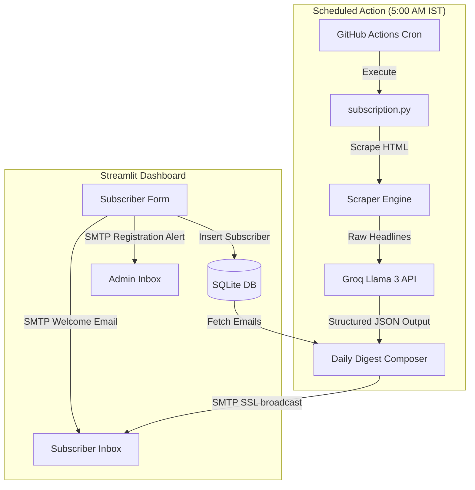

# 📈 FinPulse AI — Automated Financial Intelligence & Newsletter Service

FinPulse AI is a modern, high-speed financial intelligence platform designed to scrape, analyze, and deliver high-signal daily financial summaries directly to users. 

By consolidating multiple local PyTorch/Hugging Face deep learning models into a single, unified JSON extraction call to **Groq Llama 3**, this project achieves production-grade inference speeds (from minutes to under ~3 seconds) and slashes deployment package size by **98%** (from 2.5 GB down to under 50 KB).

---

##  Key Core Features

### 1. **Interactive Subscriber Dashboard (Streamlit)**
* Sleek, modern card-based UI that handles user onboarding.
* Automated welcome emails delivered on subscription.
* Real-time SMTP notification alerts dispatched to the administrator when a new user registers.
* Live interactive portal to test Groq Llama 3 summaries.

### 2. **Consolidated AI pipeline (Unified Structured Extraction)**
* Uses Groq Cloud's `llama-3.3-70b-versatile` running at 300+ tokens per second.
* Adheres to a strict JSON schema via structured output formatting.
* Automatically resolves complex Indian financial news entities to correct **NSE/BSE ticker symbols** (e.g. `RELIANCE.NS`, `INFY.NS`), bypassing false positives (like mapping generic words like *"bank"* or *"RBI"* to tickers).
* Deduplicates headlines and categorizes news into *Market & Stocks*, *Economy & Policy*, and *Global & Industry*.
* Generates a concise HTML-formatted executive brief for the day's market movements.

### 3. **Robust Scraper & Persistence Engine**
* **Multi-Source Hybrid Scraper**: Dynamically harvests financial headlines from Moneycontrol, The Economic Times, Business Standard, LiveMint, and CNBC-TV18 using BeautifulSoup (`requests`) and Selenium (`headless mode`).
* **Zero-Config Database**: Employs a local SQLite engine (`sqlite3`) for subscriber indexing, enabling local self-contained execution without setup friction.

### 4. **Daily Automation (CI/CD)**
* Fully automated via **GitHub Actions** workflows.
* Triggers every morning at **5:00 AM IST** to scrape news, invoke the Groq structured extraction pipeline, assemble a premium HTML email template, and broadcast it to all registered subscribers.

---

##  Tech Stack & Dependencies

* **Frontend**: Streamlit
* **AI Model Engine**: Groq Cloud API (`llama-3.3-70b-versatile`)
* **Data Scrapers**: Selenium WebDriver, BeautifulSoup4, Requests
* **Database**: SQLite3
* **Email Protocols**: SMTP (TLS/SSL) with MIME Multipart formatting
* **CI/CD/Automation**: GitHub Actions

---

##  Repository Layout

```
finpulse-ai/
├── .github/
│   └── workflows/
│       └── newsletter.yml     # Automated morning cron pipeline
├── app.py                     # Streamlit frontend application & UI portal
├── database.py                # Subscriber database CRUD (SQLite)
├── mail.py                    # Onboarding emails & Admin registration alerts
├── model.py                   # Unified Groq extraction & rule-based fallbacks
├── news.py                    # Headless Chrome news scraping engine
├── subscription.py            # Daily newsletter broadcast orchestrator
├── requirements.txt           # Standard Python package dependencies
├── deploy_requirements.txt    # Lightweight server deployment list
├── context.md                 # Technical architecture documentation
└── suggestions.txt            # Design iterations & UX suggestions
```

---

##  Quick Start & Installation

### Prerequisite Setup
1. **Python Installation**: Ensure you are running Python 3.10 or higher.
2. **Chrome Browser**: Needed by the news scraper to crawl JavaScript-rendered elements.

### Step 1: Clone and Install
```bash
# Clone the repository
git clone https://github.com/yourusername/finpulse-ai.git
cd finpulse-ai

# Install python dependencies
pip install -r requirements.txt
```

### Step 2: Configure Environment Variables
Create a `.env` file in the root workspace folder:
```env
# Groq API Configuration
key=YOUR_GROQ_API_KEY_HERE

# SMTP/Gmail Relay Configuration
SENDER_MAIL=your_gmail_username@gmail.com
SMTP_KEY=your_16_character_app_password_here
```
> **Note**: The `SMTP_KEY` requires a Google Workspace / Gmail App Password. Learn how to generate one [here](https://support.google.com/accounts/answer/185833?hl=en).

### Step 3: Run the Dashboard
Start the Streamlit subscriber portal locally:
```bash
streamlit run app.py
```
Open `http://localhost:8501` to view the UI.

### Step 4: Run the Newsletter Pipeline Manually
To crawl news, generate the structured summary, and dispatch the newsletter:
```bash
python subscription.py
```
*If SMTP credentials are not present in `.env`, the script automatically falls back to saving a local `newsletter_preview.html` file in the workspace directory.*

---

##  System Design Overview

Below is the conceptual framework showing how user registration and scheduled broadcasts flow through the system:



---

##  Scalability & Roadmap
For enterprise-grade scaling, the repository is ready to integrate the following upgrades:
* **Serverless Postgres**: Switch SQLite to cloud-based serverless storage (Neon.tech / Supabase) for horizontally scaled container deployments.
* **Resend/SendGrid Integration**: Transition from SMTP relays to a dedicated Email Service Provider (ESP) to guarantee 99.9% deliverability.
* **Double Opt-In**: Introduce subscriber token verification links to prevent signup spam.
