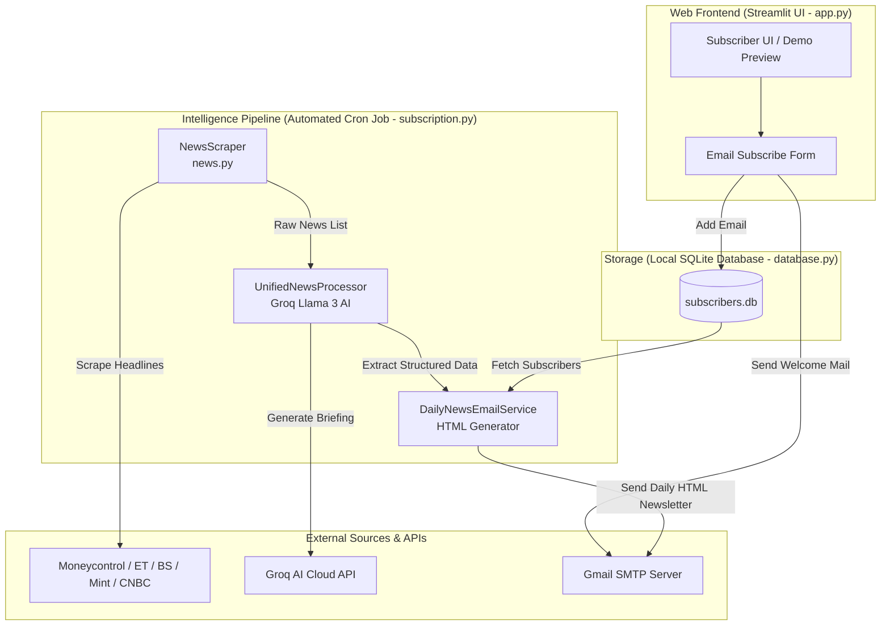

# FinPulse AI – Project Context & Architecture Documentation

## 1. Executive Summary
**FinPulse AI** is an automated financial intelligence platform and newsletter service. It combines a responsive web frontend built with Streamlit with an automated, high-speed backend intelligence pipeline powered by Llama 3 models on Groq Cloud and Selenium/BeautifulSoup web scrapers.

The application serves two primary workflows:
1. **Interactive Subscriber Portal**: Allows users to subscribe to daily newsletters, storing their emails in a local SQLite database and immediately dispatching an automated welcome email.
2. **Automated Daily Intelligence Pipeline**: A scheduled cron job (via GitHub Actions) that scrapes daily financial news from top Indian and global publications, performs Named Entity Recognition (NER), Zero-Shot Categorization, and Sentiment Analysis in a consolidated, single-shot structured JSON Groq API call, and delivers a curated HTML financial digest to subscribers via Gmail SMTP.

---

## 2. High-Level Architecture & Data Flow



---

## 3. Directory Structure & File Overview

```
finpulse-ai/
├── .github/workflows/
│   └── newsletter.yml         # GitHub Actions cron schedule for daily digest delivery
├── app.py                     # Streamlit frontend UI and subscription handler
├── database.py                # Local SQLite connection and CRUD operations
├── mail.py                    # WelcomeEmailSender for onboarding emails
├── model.py                   # UnifiedStructuredExtraction engine & Groq AI Summarizer
├── news.py                    # Multi-source Selenium & BeautifulSoup news scraper
├── subscription.py            # Main orchestrator script for the daily newsletter workflow
├── requirements.txt           # Comprehensive Python dependencies
├── deploy_requirements.txt    # Lightweight dependencies for deployment
├── subscribers.db             # Zero-config local SQLite database (auto-generated)
├── suggestions.txt            # Design ideas and visual layout improvements
└── context.md                 # Project architecture & context documentation (this file)
```

---

## 4. Detailed Component Analysis

### A. Web Application Frontend ([app.py](file:///c:/Users/vihan/OneDrive/Desktop/finpulse-ai/app.py))
* **Framework**: Streamlit (`st.set_page_config(page_title="📈 Financial Dashboard", layout="wide")`).
* **State Management**: Uses `st.session_state["page"]` to toggle between two views:
  * `home`: Displays the main newsletter branding, an email subscription form, inspirational quotes, and technical badges.
  * `demo`: Displays a sample static HTML preview of the newsletter layout (Top Headlines, Securities to Watch, Market & Stocks, Economy & Policy, Global & Industry).
* **Subscription Flow**:
  1. Validates input email formatting (`@` check).
  2. Calls `add_subscriber(email_input)` from `database.py`.
  3. If successful (new subscriber), invokes `WelcomeEmailSender().send_welcome_email(email_input)` from `mail.py` to deliver an onboarding message.

### B. Database Layer ([database.py](file:///c:/Users/vihan/OneDrive/Desktop/finpulse-ai/database.py))
* **Driver**: Standard library `sqlite3` connecting to a local file database (`subscribers.db`). This eliminates cloud database dependencies and enables offline/local execution.
* **Schema**:
  ```sql
  CREATE TABLE IF NOT EXISTS subscribers (
      id INTEGER PRIMARY KEY AUTOINCREMENT,
      email TEXT UNIQUE NOT NULL,
      subscribed_at TIMESTAMP DEFAULT CURRENT_TIMESTAMP
  );
  ```
* **Key Functions**:
  * `create_table()`: Ensures the SQLite database file and schema exist upon application startup.
  * `add_subscriber(email)`: Executes `INSERT INTO subscribers (email) VALUES (?)`. Catches `sqlite3.IntegrityError` to cleanly return `False` if the email is already registered.
  * `get_all_subscribers()`: Retrieves all subscribed email addresses for automated broadcasting.

### C. News Acquisition & Scraper ([news.py](file:///c:/Users/vihan/OneDrive/Desktop/finpulse-ai/news.py))
* **Scraping Strategy**: Implements a hybrid scraping mechanism in `NewsScraper` using both static HTTP requests (`requests` + `BeautifulSoup`) and dynamic rendering (`selenium` Chrome WebDriver running in `--headless` mode).
* **Target Sources**:
  1. **Moneycontrol**: Scrapes business/stock news via `requests` (`li.clearfix`).
  2. **The Economic Times**: Scrapes market news via `requests` (`ul.newsList`).
  3. **Business Standard**: Scrapes cards via Selenium (`cardlist`), stripping metadata tokens like `"premium"` and `"X min read"`.
  4. **LiveMint**: Scrapes latest news via Selenium (`listingNew`).
  5. **CNBC-TV18**: Scrapes market headlines via `requests` (`h3.jsx-f14ac246253a1b7d`).
* **Output**: Aggregates all cleaned headline strings into a unified list returned by `get_all_news()`.

### D. AI & NLP Intelligence Pipeline ([model.py](file:///c:/Users/vihan/OneDrive/Desktop/finpulse-ai/model.py))
This module houses the AI extraction classes, replacing the three separate local Hugging Face CPU models (RoBERTa for sentiment, DeBERTa for zero-shot classification, and BERT for NER) with a single-shot structured JSON Groq API call:

1. **`UnifiedNewsProcessor` (Consolidated Structured LLM Extraction)**
   * **Model**: Llama 3 (`llama-3.3-70b-versatile` on Groq).
   * **Logic**: Evaluates a batch of up to 30 news headlines in a single API call with `response_format: {"type": "json_object"}`. Returns a unified JSON containing top market catalyst headlines, categorized headlines, verified stock tickers (NSE/BSE formatted), and a clean HTML market executive briefing.
   * **Robust Fallback**: If the Groq key is missing or the API times out, uses a fast local rule-based heuristic classifier and internal dictionary mapping to prevent newsletter generation failure.

2. **Backward-Compatible Proxy Classes**
   * **`HeadlineSelector`**, **`StockMentionMapper`**, **`NewsCategorizer`**, and **`NewsSummarizer`** are preserved as lightweight classes without PyTorch/Transformers dependencies, delegating to fast internal rules or online lookups to support existing scripts without memory overhead.

### E. Email Dispatch Services ([mail.py](file:///c:/Users/vihan/OneDrive/Desktop/finpulse-ai/mail.py) & [subscription.py](file:///c:/Users/vihan/OneDrive/Desktop/finpulse-ai/subscription.py))
* **Onboarding & Notification Mail (`mail.py` - `WelcomeEmailSender`)**:
  * Establishes a TLS SMTP connection to `smtp.gmail.com:587` using `SENDER_MAIL` and `SMTP_KEY` (Gmail App Password).
  * Constructs and sends a welcome HTML email to the new subscriber.
  * Automatically sends a notification alert email to the administrator/owner (`SENDER_MAIL`) containing the email address of the new registrar.
* **Daily Newsletter Delivery (`subscription.py` - `DailyNewsEmailService`)**:
  * **HTML Digest Generation**: Assembles a styled HTML report containing:
    * **Securities to Watch**: Top mentioned stocks formatted as `💹 Name (TICKER)`.
    * **Top 5 Headlines**: High-impact news ranked by sentiment strength.
    * **Categorized Breakdowns**: Top stories each across Market & Stocks, Economy & Policy, and Global & Industry.
  * **SMTP Delivery**: Establishes an SSL SMTP connection to `smtp.gmail.com:465` and delivers the generated newsletter to all subscribers.

---

## 5. Automation & CI/CD Pipeline ([.github/workflows/newsletter.yml](file:///c:/Users/vihan/OneDrive/Desktop/finpulse-ai/.github/workflows/newsletter.yml))
The daily newsletter generation and dispatch are fully automated without requiring a dedicated always-on backend server:
* **Trigger**: Scheduled via Cron (`30 23 * * *` UTC, which equals **5:00 AM IST daily**) or manually via `workflow_dispatch`.
* **Execution Environment**: Runs on `ubuntu-latest` with Python 3.10.
* **Workflow Steps**:
  1. Checks out repository code and installs dependencies from `requirements.txt`.
  2. Injects required secrets (`SENDER_MAIL`, `SMTP_KEY`) into environment variables.
  3. Executes `python subscription.py`, which triggers web scraping, AI model inference, newsletter formatting, and email broadcasting in a single batch execution.

---

## 6. Key Configuration & Environment Variables
The project relies on a `.env` file (loaded via `python-dotenv`) containing the following critical credentials:
* `key` (or `GROQ_API_KEY`): Groq API Key used to power the Llama 3 structured AI pipeline.
* `DB_PATH`: Optional custom path for the local SQLite database file (defaults to `subscribers.db` in root).
* `SENDER_MAIL`: The Gmail address used to dispatch outgoing onboarding and newsletter emails.
* `SMTP_KEY`: The 16-character Google Workspace / Gmail App Password authorized for SMTP transmission.
